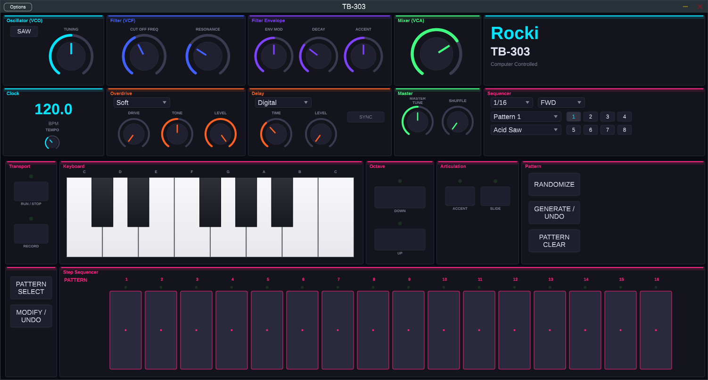

# TB-303 Synthesizer Plugin

A TB-303 Bass Line synthesizer clone by **Rocki**, built as a **VST3 plugin** and **Standalone application** using the [JUCE](https://juce.com/) framework (C++17).



## Features

### Sound Engine
- **Polyblep oscillator** — Sawtooth and Square waveforms (band-limited, alias-free)
- **Diode ladder filter** — 4-pole 24dB/oct resonant lowpass with self-oscillation
- **Decay-only filter envelope** — near-instant attack (~3ms), variable decay (30ms–3s)
- **ENV MOD** — controls envelope depth to filter cutoff
- **Accent** — boosts filter envelope depth and output volume per step
- **Slide** — 60ms portamento glide between consecutive notes
- **Tuning** — oscillator detune (-12 to +12 semitones)
- **Master Tune** — fine tuning offset

### Effects
- **Overdrive** — 3 types: Soft clip, Hard clip, Tube
  - Drive (depth), Tone, and Level controls
- **Delay** — 3 types: Digital (clean), Tape (filtered feedback), Ping Pong (stereo)
  - Time, Level (wet mix) controls
  - **Tempo Sync** — snaps delay time to musical note divisions

### Step Sequencer
- **16-step** pattern sequencer — all 16 steps visible and editable
- Per-step: Note, Octave, Accent, Slide, Active toggle
- **64 pattern slots** (8 banks x 8 patterns)
- **5 play modes**: Forward, Reverse, FWD&REV, Invert, Random
- **Scale**: 1/16, 1/16 Triplet, 1/32 note divisions
- **Shuffle/Swing** control
- **Pattern Clear** — reset all steps in current pattern
- **Randomize** with undo
- **Record mode** — input notes from keyboard into sequencer steps
- **Host tempo sync** when used as VST3 in a DAW
- **BPM display** — large real-time tempo readout

### Presets
- 10 factory patches: Acid Saw, Acid WideOD Saw, Squelch Square, Rubber Bass, Hard Acid, Mellow Square, Screaming Lead, Deep Sub, Delay Acid, Tube Distortion
- Save/load patches and patterns (persisted in plugin state)
- MIDI input for live keyboard play

## UI Layout

The interface is organized into **color-coded sections** for quick identification:

### Top Area — Synthesis & Effects
| Section | Color | Controls |
|---------|-------|----------|
| **Oscillator (VCO)** | Cyan | Waveform (SAW/SQR), Tuning |
| **Filter (VCF)** | Blue | Cut Off Frequency, Resonance |
| **Filter Envelope** | Purple | Env Mod, Decay, Accent |
| **Mixer (VCA)** | Green | Volume |
| **Clock** | Cyan | BPM Display, Tempo |
| **Overdrive** | Orange | Drive Type, Drive, Tone, Level |
| **Delay** | Orange | Delay Type, Time, Level, Tempo Sync |
| **Master** | Green | Master Tune, Shuffle |
| **Sequencer** | Pink | Scale, Play Mode, Pattern/Patch Select, Bank 1-8 |

### Bottom Area — Sequencer & Performance
| Section | Color | Controls |
|---------|-------|----------|
| **Transport** | Pink | Run/Stop, Record |
| **Keyboard** | Pink | 13-key piano (C to C), note input |
| **Octave** | Pink | Down, Up |
| **Articulation** | Pink | Accent, Slide |
| **Pattern** | Pink | Randomize, Generate/Undo, Pattern Clear |
| **Step Sequencer** | Pink | 16 step toggles with LED indicators, Pattern Select, Modify/Undo |

## Quick Start

### macOS

```bash
# 1. Install Homebrew (if not already installed)
/bin/bash -c "$(curl -fsSL https://raw.githubusercontent.com/Homebrew/install/HEAD/install.sh)"

# 2. Install build tools
brew install cmake ninja

# 3. Clone and build
git clone https://github.com/domenicrocki/TB303Synth.git
cd TB303Synth
cmake -B build -G Ninja -DCMAKE_BUILD_TYPE=Release
cmake --build build

# 4. Run standalone
./build/TB303Synth_artefacts/Release/Standalone/TB-303.app/Contents/MacOS/TB-303

# 5. Install VST3 plugin (optional)
cp -r build/TB303Synth_artefacts/Release/VST3/TB-303.vst3 ~/Library/Audio/Plug-Ins/VST3/
```

### Linux

```bash
# 1. Install build tools and JUCE dependencies
sudo apt-get install -y build-essential cmake ninja-build \
  libasound2-dev libfreetype-dev libx11-dev \
  libxrandr-dev libxinerama-dev libxcursor-dev libgl-dev

# 2. Clone and build
git clone https://github.com/domenicrocki/TB303Synth.git
cd TB303Synth
cmake -B build -G Ninja -DCMAKE_BUILD_TYPE=Release
cmake --build build

# 3. Run standalone
./build/TB303Synth_artefacts/Release/Standalone/TB-303

# 4. Install VST3 plugin (optional)
cp -r build/TB303Synth_artefacts/Release/VST3/TB-303.vst3 ~/.vst3/
```

### Windows

1. Install [Visual Studio 2019+](https://visualstudio.microsoft.com/) with **C++ desktop development** workload
2. Install [CMake 3.22+](https://cmake.org/download/) (or use the one included with Visual Studio)

```powershell
git clone https://github.com/domenicrocki/TB303Synth.git
cd TB303Synth
cmake -B build -DCMAKE_BUILD_TYPE=Release
cmake --build build --config Release
```

VST3 output: `build\TB303Synth_artefacts\Release\VST3\TB-303.vst3`
Copy to: `C:\Program Files\Common Files\VST3\`

## VST3 Installation

| OS      | VST3 Path                                |
|---------|------------------------------------------|
| macOS   | `~/Library/Audio/Plug-Ins/VST3/`         |
| Linux   | `~/.vst3/`                               |
| Windows | `C:\Program Files\Common Files\VST3\`    |

Then rescan plugins in your DAW (Ableton Live, Logic Pro, Bitwig, Reaper, FL Studio, etc.).

## Build Notes

- **JUCE 7.0.9** is downloaded automatically via CMake FetchContent — no manual installation needed
- First build takes a few minutes (downloads and compiles JUCE)
- Subsequent builds are fast (only recompiles changed files)

## Controls Reference

### Oscillator (VCO)

| Control | Function |
|---------|----------|
| **WAVEFORM** | Toggle between Sawtooth and Square oscillator |
| **TUNING** | Oscillator pitch offset (-12 to +12 semitones) |

### Filter (VCF)

| Control | Function |
|---------|----------|
| **CUT OFF FREQ** | Filter cutoff frequency (20Hz – 20kHz, exponential) |
| **RESONANCE** | Filter resonance (0 to self-oscillation) |

### Filter Envelope

| Control | Function |
|---------|----------|
| **ENV MOD** | Filter envelope modulation depth (how far cutoff sweeps) |
| **DECAY** | Filter envelope decay time (30ms – 3s) |
| **ACCENT** | Accent intensity — boosts filter envelope depth + output volume |

### Mixer (VCA)

| Control | Function |
|---------|----------|
| **VOLUME** | Master output volume |

### Clock

| Control | Function |
|---------|----------|
| **BPM Display** | Real-time tempo readout (large LED-style digits) |
| **TEMPO** | Sequencer tempo (20 – 300 BPM) |

### Overdrive (FX)

| Control | Function |
|---------|----------|
| **DRIVE TYPE** | Distortion character: Soft / Hard / Tube |
| **DRIVE** | Drive amount (depth of distortion) |
| **TONE** | Post-drive tone shaping (dark to bright) |
| **LEVEL** | Overdrive output level |

### Delay (FX)

| Control | Function |
|---------|----------|
| **DELAY TYPE** | Delay character: Digital / Tape / Ping Pong |
| **TIME** | Delay time (1ms – 2000ms) |
| **LEVEL** | Delay wet/dry mix |
| **SYNC** | Sync delay time to host BPM |

### Master

| Control | Function |
|---------|----------|
| **MASTER TUNE** | Fine tuning offset (-100 to +100 cents) |
| **SHUFFLE** | Swing amount — delays even-numbered steps (0 – 100%) |

### Sequencer

| Control | Function |
|---------|----------|
| **SCALE** | Step note division: 1/16, 1/16 Triplet, 1/32 |
| **PLAY MODE** | Sequence direction: Forward / Reverse / FWD&REV / Invert / Random |
| **PATTERN** | Select current pattern (1–8 per bank) |
| **PATCH** | Load a synth patch preset |
| **BANK 1–8** | Select pattern bank (8 banks x 8 patterns = 64 total) |

### Transport & Performance

| Control | Function |
|---------|----------|
| **RUN / STOP** | Start or stop the sequencer |
| **RECORD** | Enable record mode — input notes from keyboard into sequencer steps |
| **KEYBOARD** | 13-key piano (C to C) — play notes live or input into sequencer |
| **DOWN / UP** | Shift keyboard octave down or up |
| **ACCENT** | Toggle accent for current step (in record mode) |
| **SLIDE** | Toggle slide/portamento for current step (in record mode) |
| **RANDOMIZE** | Generate a random pattern |
| **GENERATE / UNDO** | Undo last randomize or pattern change |
| **PATTERN CLEAR** | Clear all steps in the current pattern |
| **PATTERN SELECT** | Select pattern slot |
| **MODIFY / UNDO** | Undo last pattern modification |
| **STEPS 1–16** | Toggle individual steps on/off — LEDs show current playback position |

## Project Structure

```
TB303Synth/
├── CMakeLists.txt                  # Build config (JUCE via FetchContent)
├── Source/
│   ├── PluginProcessor.h/cpp      # Audio processor, APVTS, state save/load
│   ├── PluginEditor.h/cpp         # Main GUI window (1500x780)
│   ├── DSP/
│   │   ├── TB303Oscillator.h/cpp  # Polyblep saw/square oscillator
│   │   ├── TB303Filter.h/cpp      # Diode ladder lowpass filter
│   │   ├── TB303Envelope.h/cpp    # Decay envelope with sustain
│   │   ├── TB303Voice.h/cpp       # Voice: osc + filter + env + accent + slide
│   │   ├── DriveEffect.h/cpp      # Overdrive (soft/hard/tube)
│   │   └── DelayEffect.h/cpp      # Delay (digital/tape/ping-pong)
│   ├── Sequencer/
│   │   ├── StepSequencer.h/cpp    # 16-step sequencer, 5 play modes
│   │   └── PatternData.h/cpp      # 8x8 pattern bank storage
│   ├── GUI/
│   │   ├── TB303LookAndFeel.h/cpp # Futuristic dark theme with section colors
│   │   ├── KnobComponent.h/cpp    # Rotary knob with colored arc + APVTS
│   │   ├── TopPanel.h/cpp         # VCO, VCF, Envelope, Mixer, Clock, FX, Sequencer
│   │   ├── MiddlePanel.h/cpp      # (Reserved)
│   │   ├── BottomPanel.h/cpp      # Transport, Keyboard, 16 Steps, Pattern
│   │   ├── LEDButton.h/cpp        # Button with LED + accent color
│   │   ├── PianoKeyboard.h/cpp    # 1-octave piano keyboard
│   │   └── StepButton.h/cpp       # Step toggle with LED indicator
│   └── Presets/
│       └── PresetManager.h/cpp    # Factory & user patch management
└── README.md
```

## License

This project is for educational purposes. TB-303 is a trademark of Roland Corporation.
